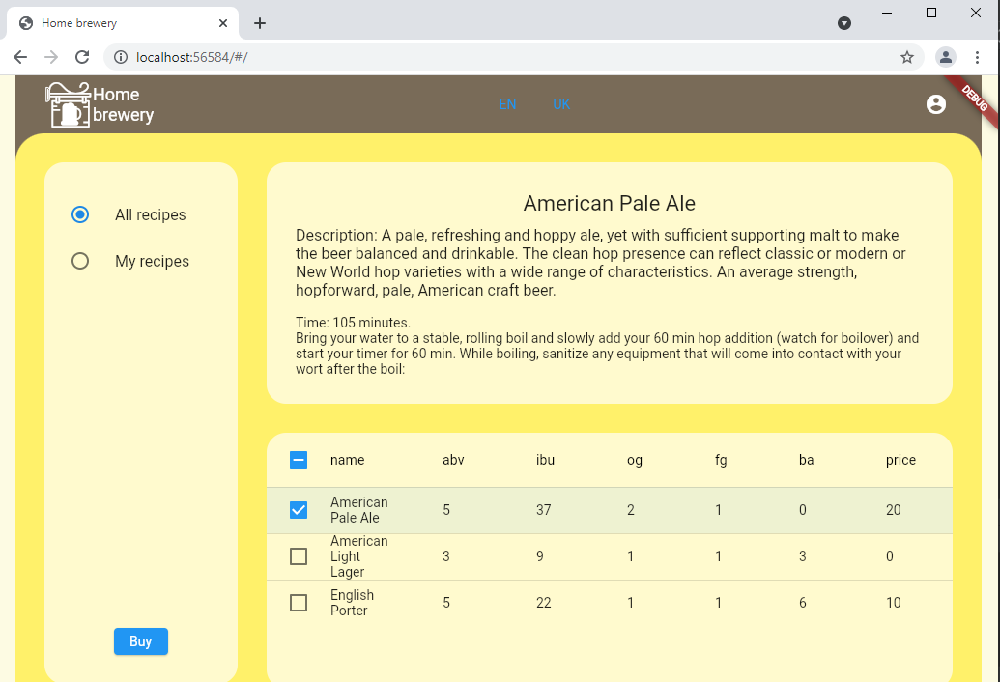
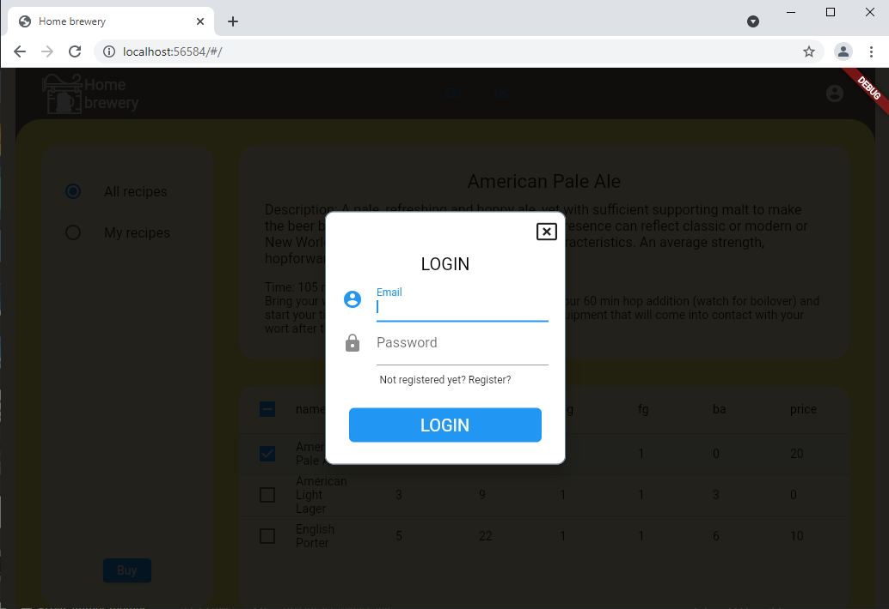
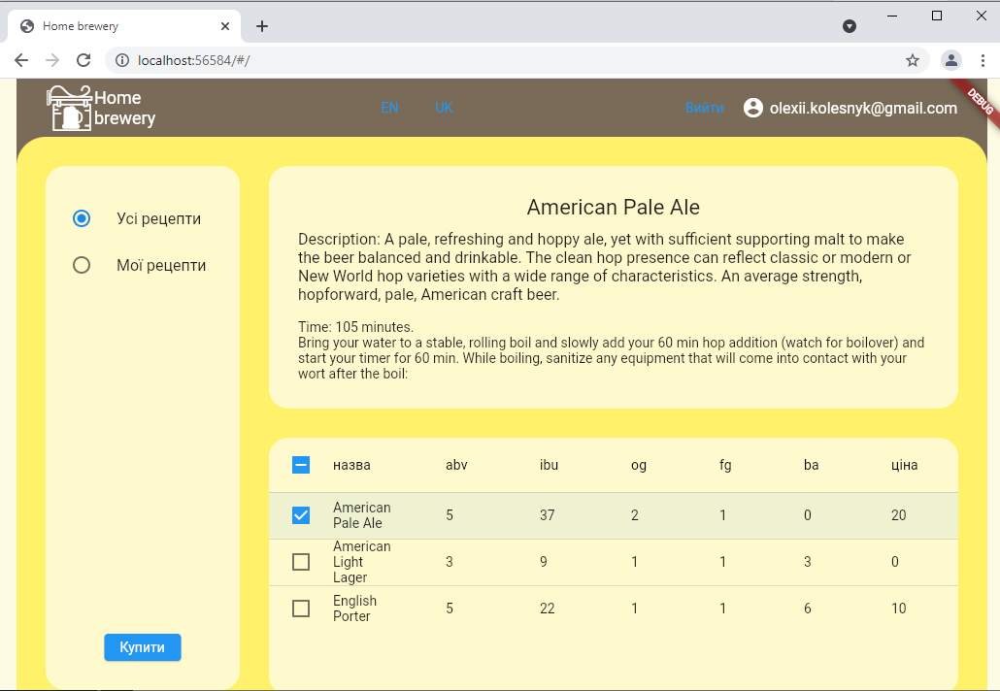

# home_brewery

It is a flutter website for the home brewing system.
It allows you to search for recipes in library, read them, buy or save some recipes.
Backend is an ASP.NET Web Api which works with SQL Server.
Web Api repo: https://github.com/al-koles/HomeBreweryWebApi.git

Features:
* authorization with Firebase Auth;
* localization (eng, ukr);
* SQL Server database;

## Screenshots

1. Interface

2. LogIn/Register menu

3. Authorized & localized

